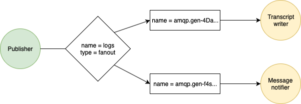

# Publish-Subscribe

> (based on the [offical Python tutorial](https://www.rabbitmq.com/tutorials/tutorial-three-python.html))

This messaging pattern allows sending the same message to more than one receiver.



In this tutorial, you'll set up a logging system with two subscribers, one will
 receive the log messages and print them on the Transcript and the other one will
 open a toast indicating that a new log message arrived.

For more information on the pattern see [publish-subsribe](https://www.enterpriseintegrationpatterns.com/patterns/messaging/PublishSubscribeChannel.html).

## Introducing the exchange

An exchange simply receives messages from producers and pushes them to queues.
 It is configured to know what to do with a message according to its type.

Let's examine part of the logger code from the previous tutorial, after the
 channel creation we have

````smalltalk
channel declareExchangeNamed: 'logs' of: 'fanout' applying: [:exchange | ].
queue := channel declareQueueApplying: [ :builder | builder beExclusive ].
channel queueBind: queue method queue exchange: 'logs' routingKey: ''.
````

These collaborations will create an exchange named `logs`, a queue, and a
 binding between the two.

Binding the exchange can be interpreted as a known address where the producer
 will send messages, to the queue from where the consumer will take out the
 messages.

Notice that the declared exchange is of type `fanout`, meaning published messages
 are going to be broadcast to all the bound queues.

## Logging to the Transcript

Running this script will spawn a logger that will post every message to the Transcript

```Smalltalk
| connection channel result logger |

connection := AmqpConnectionBuilder new
  hostname: 'localhost';
  build.
connection open.

channel := connection createChannel.
channel declareExchangeNamed: 'logs' of: 'fanout' applying: [:exchange | ].
result := channel declareQueueApplying: [ :queue | ].
channel queueBind: result method queue exchange: 'logs' routingKey: ''.

channel 
  consumeFrom: result method queue
  applying: [ :messageReceived | Transcript show: ('<1s><n>' expandMacrosWith: messageReceived body utf8Decoded) ]. 

logger := Process
    forContext:
     [ [ [  connection waitForEvent ] repeat ]
      ensure: [ connection close ]
     ] asContext
    priority: Processor activePriority.

logger name: 'Transcript logger'.
logger resume 
```

## Receiveing notifications

Here's the script to spawn a process that will pop up a toast notification on
 every log message received

```Smalltalk
| connection channel result logger |

connection := AmqpConnectionBuilder new
  hostname: 'localhost';
  build.
connection open.

channel := connection createChannel.
channel declareExchangeNamed: 'logs' of: 'fanout' applying: [:exchange | ].
result := channel declareQueueApplying: [ :queue | ].
channel queueBind: result method queue exchange: 'logs' routingKey: ''.

channel 
  consumeFrom: result method queue
  applying: [ :messageReceived | self inform: 'A log message has arrived!' ].  

logger := Process
    forContext:
     [ [ [  connection waitForEvent ] repeat ]
      ensure: [ connection close ]
     ] asContext
    priority: Processor activePriority.

logger name: 'Transcript logger'.
logger resume 
```

See that they only differ in the callback they register.

## Producing logs

This is the script to produce log entries. Unlike the previous tutorial, you'll be publishing messages to the exchange, not directly to a queue

```smalltalk
| connection channel result |

connection := AmqpConnectionBuilder new
  hostname: 'localhost';
  build.
connection open.

channel := connection createChannel.
channel declareExchangeNamed: 'logs' of: 'fanout' applying: [:exchange | ].

channel basicPublish: '2014-10-31 13:11:10.8458 [Info] Service started up' utf8Encoded exchange: 'logs' routingKey: ''. 
channel
```

## Running the example

Open two Ansible images to isolate the publisher from the consumers.

On one evaluate, in diferent Playgrounds, the scripts for spawning the logger and
 the notifier. Don't forget to open the Transcript!

On the other image, inspect in a Playground the producer script. Use the inspector
 on the channel to send more messages like you did in the previous tutorial.

After sending a couple of messages the subscriber's Transcript will look like this


Also, you'll receive a notification for every message  like this one


## Next

In the next tutorial you'll learn how to refine this example, go ahead to learn
 the basics of [routing](Routing.md).
