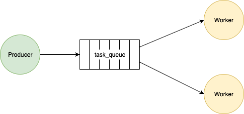

# Worker queue

(based on the [offical Python tutorial](https://www.rabbitmq.com/tutorials/tutorial-two-python.html))

Work queues allow distributing time-consuming tasks between multiple workers to
 minimize the time the producer has to wait for them to complete. Tasks are
 encapsulated as messages and send to the broker. The broker enqueues them and
 performs a round-robin dispatched to the workers.



In this tutorial, you'll model tasks as a dotted string, where each dot represents
 a degree of complexity, therefore the longer the string, the longer it will
 take (i.e. `'...'` is a task taking 3 seconds to complete).

This schema is also known as [Competing Consumers](https://www.enterpriseintegrationpatterns.com/patterns/messaging/CompetingConsumers.html).

## A brief review of concepts

Let's review AMQP concepts by inspecting a consumer setup step-by-step. The first
 thing you need to do is establish a connection to the broker

```smalltalk
connection := AmqpConnectionBuilder new
  hostname: 'localhost';
  build.
connection open.
```

Then you need to create a channel, as it is required by all operations performed
 by a client

```smalltalk
channel := connection createChannel.
```

Channels are logical connections to the broker. Channels allow sharing a
 connection by multiplexing the messages through them; this means communication
 on a channel is isolated from communication on other channels sharing the same connection.

On this channel you're going to create a queue named `task_queue`

````Smalltalk
channel declareQueueApplying: [ :queue | queue name: 'task_queue' ].
channel prefetchCount: 1.
````

The `channel prefetchCount: 1` directs RabbitMQ to wait for an acknowledge of
 the last message before sending another to the worker. Without this, the broker
 will send the messages to the worker as soon as they enter the queue (regardless
 of whether the worker is ready to receive more messages).

Now you'll create a subscription to the queue. First you a register a callback,
 which will simulate running a task by creating a delay of n seconds, where n
 is the amount of dots in the message. It will open a toast message for each
 received message by the consumer showing the time it took, and it will send
 the acknowledge to the broker.

```smalltalk
channel
  consumeFrom: 'task_queue'
  applying: [ :messageReceived | | elapsedTime |

  elapsedTime :=  messageReceived body utf8Decoded count: [ :char | char = $. ].

  (Delay forSeconds: elapsedTime) wait.
  self inform: (
    '<1s> just finished a new task for <2p> seconds'
      expandMacrosWith: workerName
      with: elapsedTime).
  channel basicAck: messageReceived method deliveryTag
].
```

If the broker does not receive the acknowledge it will wait forever since there
 is no timeout. If the connection dies RabbitMQ will re-queue the message and
 try to send it again.

## Spawning workers

You need to add this last collaboration to the end of the script to spawn a
 worker process

```smalltalk
worker := Process
  forContext:
   [ [ [  connection waitForEvent ] repeat ]
    ensure: [ connection close ]
   ] asContext
  priority: Processor activePriority.

worker name: workerName.
worker resume
```

That's it! Here you can check the complete script with all the steps described.

```smalltalk
| workerName connection channel worker |

workerName := 'Minion #1'.

connection := AmqpConnectionBuilder new
 hostname: 'localhost';
 build.
connection open.

channel := connection createChannel.
channel declareQueueApplying: [ :queue | queue name: 'task_queue' ].
channel prefetchCount: 1.

channel
  consumeFrom: 'task_queue'
  applying: [ :messageReceived | | elapsedTime |

  elapsedTime :=  messageReceived body utf8Decoded count: [ :char | char = $. ].

  (Delay forSeconds: elapsedTime) wait.
  self inform:
    ('<1s> just finished a new task for <2p> seconds'
      expandMacrosWith: workerName
      with: elapsedTime).
  channel basicAck: messageReceived method deliveryTag
].

worker := Process
    forContext:
     [ [ [  connection waitForEvent ] repeat ]
      ensure: [ connection close ]
     ] asContext
    priority: Processor activePriority.

worker name: workerName.
worker resume
```

## Setting up the producer

Here's the producer script

```smalltalk
| connection channel |
connection := AmqpConnectionBuilder new
  hostname: 'localhost';
  build.
connection open.

channel := connection createChannel.
channel declareQueueApplying: [ :queue | queue name: 'task_queue' ].
channel basicPublish: '.' utf8Encoded exchange: '' routingKey: 'task_queue'.
channel
```

The last line publishes a message to the `task_queue`. Yes, we are creating the
 queue again. Queue creation operation will not create a new one if one with that
 name already exists. The same applies to other AMQP entities such as exchanges
 and bindings.

## Running the example

Open three Ansible images. Two will act as workers and the last one as producer.

On the images acting as worker open a Playground and evaluate the corresponding
 script. Now, on the third one inspect the producer script on a Playground. This
 will send your first message.

Since you inspected the script, an inspector on a instance of channel will open.
 To send more messages to the workers send  `#basicPublish:exchange:routingKey:`
 to it.

After each message sent you should see a toast notification on one your worker
 images, not on both. It will look like this


## Next

Let's learn another integration pattern, discover the [publish-subscribe](PublishSubscribe.md)
 messaging pattern with Ansible!
