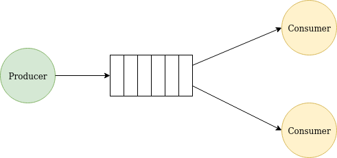

# Worker queue



Work queues allow distributing time-consuming tasks between multiple workers to minimize the time the producer has to wait for it to complete. Tasks are encapsulated as messages and send to the broker. The broker enqueues them and performs a round-robin dispatched to the workers.

For this tutorial, we will model the task as a dotted string. Each dot represents a degree of complexity therefore, the longer the string, the longer it will take.

This schema is also known as [CompetingConsumers](https://www.enterpriseintegrationpatterns.com/patterns/messaging/CompetingConsumers.html)

## A brief review of concepts 

Let's review AMQP concepts by inspecting a consumer setup step-by-step. 

The first thing you need to do is stablish a connection to the broker

````Smalltalk
connection := AmqpConnectionBuilder new
	hostname: 'localhost';
	build.
connection open.
````

Then you need to create a channel since every operation performed by a client happens on it.

````Smalltalk
channel := connection createChannel.
````

Channels are logical connections to the broker. Channels allow sharing a connection by multiplexing the messages through them; this means communication on a channel is isolated from communication on other channels sharing the same connection. 

On this channel you´re going to create an exchange, a queue, and a binding between the two.

````Smalltalk
channel declareExchangeNamed: 'tasks' of: 'direct' applying: [:exchange | ].
result := channel declareQueueApplying: [ :queue | ].
channel queueBind: result method queue exchange: 'tasks' routingKey: ''.
````

Binding the exchange can be interpreted as a known address where the producer will send messages, to the queue from where the consumer will take out the messages. Now with the following collaboration, you'll create a subscription to the queue registering a callback that will open an inspector on each received message by the consumer.

One important thing to notice is that the declared exchange is of type `direct`. This configures the exchange to send messages to the queues whose binding key exactly matches the routing key of the message.

````Smalltalk
channel 
	consumeFrom: result method queue
	applying: [ :messageReceived | messageReceived inspect ].	
````

## Spawning consumers

You need to add this last collaboration to spawn a ~minion~ consumer to the end of the script:

````Smalltalk
minion := Process
	forContext:
		[ [ [ connection waitForEvent ] repeat ] 
			ensure: [ connection close ] 
		] asContext priority: Processor activePriority.
	minion name: 'Minion'.
	
minion resume 
````

Here's the complete script, open a new Pharo image and evaluate it on a Playground

```Smalltalk
| connection channel result minion |

connection := AmqpConnectionBuilder new
	hostname: 'localhost';
	build.
connection open.

channel := connection createChannel.
channel declareExchangeNamed: 'tasks' of: 'direct' applying: [:exchange | ].
result := channel declareQueueApplying: [ :queue | ].
channel queueBind: result method queue exchange: 'tasks' routingKey: ''.
channel 
	consumeFrom: result method queue
	applying: [ :messageReceived | messageReceived inspect ].	

minion := Process
				forContext:
					[ [ [ connection waitForEvent ] repeat ]
						ensure: [ connection close ]
					] asContext
				priority: Processor activePriority.
	minion name: 'Minion'.
	
minion resume 
````

At this point probably you noticed you could run this script multiple times in the same image by changing the process name,  but try running it just once and use multiple images for simplicity.

## Setting up the producer

Open another image with Ansible loaded and in a Playground evaluate the following code:

````Smalltalk
| connection channel |
connection := AmqpConnectionBuilder new
	hostname: 'localhost';
	build.
connection open.

channel := connection createChannel.
channel declareExchangeNamed: 'tasks' of: 'direct' applying: [:exchange | ].
channel basicPublish: '.' utf8Encoded exchange: 'tasks' routingKey: ''.
channel
````

The last line publishes a message to the previously agreed exchange. Yes, we are creating the exchange again. Exchange creation operation will not create a new one if one with that name already exists. The same applies to other AMQP entities such as queues and bindings. 

## Running the example

First, run the consumer script on at least two images and then inspect the producer script in another one and start sending messages on the channel using the inspector by sending `#basicPublish:exchange:routingKey:`

